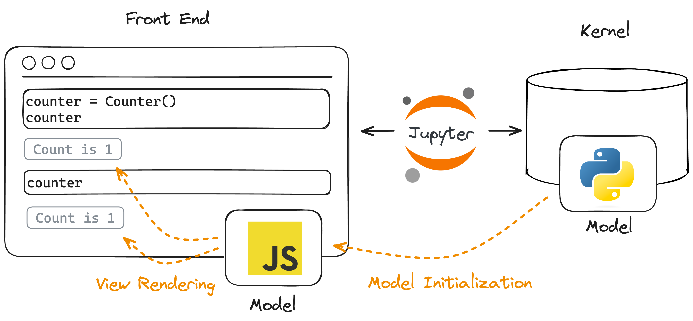

_This page is largely adapted from
["Building a Custom Widget"](https://ipywidgets.readthedocs.io/en/8.0.2/examples/Widget%20Custom.html)
in the Jupyter Widgets documentation. I'd hoped to avoid separately documenting
the Jupyter Widgets API, but their tutorial mixes boilerplate/packaging details
with core "concepts" to Jupyter Widgets. Below is an attempt to distill these
concepts for **anywidget** authors._

## Watch & Learn

This video provides a practical guide to **anywidget** fundementals, including
synchronizing Python and JavaScript state, binary data, animations, and
publishing a package on PyPI.

<iframe
  client:visible
  class="rounded-md max-w-xl m-auto"
  src="https://www.youtube.com/embed/oZhyilx3gqI?si=vFhviCebYi6FBuWN"
  title="YouTube video player"
  frameborder="0"
  allow="accelerometer; autoplay; clipboard-write; encrypted-media; gyroscope; picture-in-picture; web-share" referrerpolicy="strict-origin-when-cross-origin"
  allowfullscreen
></iframe>

More detailed explantations of specific widget concepts are included below.

## The Widget Front End

This section frames the Jupyter Widgets documentation in the context of
**anywidget**. Remember that **anywidget** is just abstraction over traditional
Jupyter Widgets that removes boilerplate and packaging details.

### Comparison with traditional Jupyter Widgets

**anywidget** simplifies creating your widget's front-end code. Its only
requirement is that your widget front-end code is a valid
[JavaScript module](https://developer.mozilla.org/en-US/docs/Web/JavaScript/Guide/Modules)
and exports `initialize` or `render` <u> _widget lifecycle hooks_</u>.

Hooks correspond to specific stages in the lifetime of a widget:

- _Model Initialization_: On instantiation in Python, a matching front-end model
  is created and synced with a model in the kernel.
- _View Rendering_: Each notebook cell displaying the widget renders an
  independent view based on the model's current state.





The `initialize` hook is similar to
[`DOMWidgetModel.initialize`](https://github.com/jupyter-widgets/ipywidgets/blob/b2531796d414b0970f18050d6819d932417b9953/packages/base/src/widget.ts#L150),
which is used for the _model initialization_, and the `render` hook is similar
to
[`DOMWidgetView.render`](https://ipywidgets.readthedocs.io/en/8.0.2/examples/Widget%20Custom.html#Render-method),
which is used for _view rendering_.

Concretely, custom widgets are traditionally defined like:

```javascript
import { DOMWidgetModel, DOMWidgetView } from "@jupyter-widgets/base";

class CustomModel extends DOMWidgetModel {
	/* ... */
}

class CustomView extends DOMWidgetView {
	render() {
		let el = this.el;
		let model = this.model;
		/* view logic */
	}
}

export { CustomModel, CustomView };
```

... which must be transformed, bundled, and installed in multiple notebook
environments.

In **anywidget**, the above code simplifies to:

```javascript
/** @param {{ model: DOMWidgetModel, el: HTMLElement }} context */
function render(context) {
	let el = context.el;
	let model = context.model;
	/* view logic */
}

export default { render };
```

... which defines _view rendering_ logic in `render` functions.

**anywidget** front-end code is often so minimal that it can easily be inlined
as a Python string:

```python
class CustomWidget(anywidget.AnyWidget):
    _esm = """
    function render(context) {
      let el = context.el;
      let model = context.model;
      /* ... */
    }
	export function { render };
    """
```

In **anywidget**, developers define _view rendering_ logic with `render`, but
_model initialization_ is usually handled automatically by the framework.
**Automatic _model initialization_ is sufficient for most widgets**, but
sometimes it can be useful to run custom logic when the front-end most is first
created. For example, a widget might need to register an event handlers just
_once_ or create some state to share across views.

In this case, you can also implement `initialize` to define _model
initialization_ logic:

```js
/** @param {{ model: DOMWidgetModel }} context */
function initialize({ model }) {
	/* (optional) model initialization logic */
}

/** @param {{ model: DOMWidgetModel, el: HTMLElement }} context */
function render(context) {
	let el = context.el;
	let model = context.model;
	/* view logic */
}

export default { initialize, render };
```

### The `render` function

Just like `DOMWidgetView.render`, your widget's `render` function is executed
exactly **once per output cell** that displays the widget instance. Therefore,
`render` primarily serves two purposes:

1. Initializing content to display (i.e., create and append element(s) to
   `context.el`)
2. Registering event handlers to update or display model state any time it
   changes (i.e., passing callbacks to `context.model.on`)

## Connecting JavaScript with Python

The Jupyter Widgets framework is build on top of the IPython Comm framework
(short for communication). It's worth reading the
[_Low Level Widget Explanation_](https://ipywidgets.readthedocs.io/en/8.0.2/examples/Widget%20Low%20Level.html#Low-Level-Widget-Explanation)
to understand the core of Jupyter Widget's Model, View, Controller (MVC)
architecture, but in short the Comm framework exposes two mechanisms to
send/receive data to/from the front end:

### 1. Traitlets

[`traitlets`](https://traitlets.readthedocs.io/en/stable/using_traitlets.html)
are the easiest and most flexible way to synchronize data between the front end
and Python. The `sync=True` keyword argument tells the widget framework to
handle synchronizing that value to the front end. Take the following
`CustomWidget`:

```python
class CustomWidget(anywidget.AnyWidget):
    _esm = pathlib.Path("index.js")
    my_value = traitlets.Int(0).tag(sync=True)
```

It defines an Integer `my_value` trait, which is synchronized with the front
end. The `render` function now has the ability to:

- **get** `my_value`

```javascript
// index.js
function render({ model, el }) {
	let my_value = model.get("my_value");
}
export default { render };
```

- **set** `my_value`

```javascript
// index.js
function render({ model, el }) {
	model.set("my_value", 42);
	model.save_changes(); // required to send update to Python
}
export default { render };
```

- **listen for changes to** `my_value` (and register event handlers)

```javascript
// index.js
function render({ model, el }) {
	function on_change() {
		let new_my_value = model.get("my_value");
		console.log(`The 'my_value' changed to: ${new_my_value}`);
	}
	model.on("change:my_value", on_change);
}
export default { render };
```

> **Note**: In the snippet above, `on_change` is called an _**event handler**_
> because it executes any time `my_value` is updated from either Python or the
> front-end code (i.e., a _change_ event).

An important aspect of traitlets, and their first-class support in Jupyter
Widgets, is that it is easy to compose Jupyter Widgets together in Python. For
example,

```python
import ipywidgets

# create a custom widget
widget = CustomWidget()

# link a slider widget with our custom widget
slider = ipywidgets.IntSlider()
ipywidgets.link((widget, "my_value"), (slider, "value"))

# log the value of `my_value` any time it changes
output = ipywidgets.Output()
@output.capture()
def handle_change(change):
    """Prints new value to `output` widget"""
    print(change.new)
widget.observe(handle_change, names=["my_value"])

ipywidgets.VBox([slider, widget, output])
```

It doesn't matter if our widget is updated from JavaScript or Python, the
IPython framework ensures it stays in sync with all the different components.

### 2. Custom messages

A second mechanism to send data to the front end is with custom messages. Within
your `render` function, you can listen to `msg:custom` events on the `model`.
For example,

```python
class CustomMessageWidget(anywidget.AnyWidget):
    _esm = """
    function render({ model, el }) {
      model.on("msg:custom", msg => {
         console.log(`new message: ${JSON.stringify(msg)}`);
       });
    }
	export default { render };
    """

widget = CustomMessageWidget()
widget # display the widget
```

```python
# send message
widget.send({ "type": "my-event", "foo": "bar" })

# Browser console:
# new message: '{ "type": "my-event", "foo": "bar" }'
```

<blockquote>

**Warning**: Custom messages are only received if your front-end code has
executed (i.e., the widget is displayed **before** sending messages). Calling
the snippet above out of order:

<br/>

```python
widget = CustomMessageWidget()

# send message, but no event listeners!
widget.send({ "type": "my-event", "foo": "bar" })

# displays widget (starts listening for events)
widget
```

</blockquote>

## Tips for beginners

**anywidget** is a minimal layer on top of Jupyter Widgets and explicitly avoids
inventing new concepts or widget APIs. Its design allows widget authors to have
nearly the same low-level control over their Jupyter integrations, but this
flexibility can be intimidating and confusing to new widget authors.

Here are some general recommendations for being productive with **anywidget**:

- **Start small**. Jupyter Widgets combine many concepts and tools from
  JavaScript and Python. Unlike traditional widgets, **anywidget** allows you to
  learn both ecosystems incrementally. Start with a
  [minimal example](/blog/introducing-anywidget#get-started), and slowly add new
  functionality. Change traitlets. Update model state from JavaScript, then
  update model state from Python. Add an event handler. It's a great way to
  learn.

- **Learn to identify ECMAScript modules (ESM)**. ESM is the core technology
  used by **anywidget**, and a deeper understanding will help you discern what
  is and (perhaps more importantly) is **_not_** standard JavaScript. I
  recommend reading Lin Clark's
  ["_ES modules: A cartoon deep-dive_"](https://hacks.mozilla.org/2018/03/es-modules-a-cartoon-deep-dive/)
  to learn more.

- **Prefer Traitlets over custom messages for state synchronization**. Widget
  state can be fully recreated from traits without Python running, whereas
  custom messages require both an active Python kernel and special ordering of
  function calls. Write logic that treats your `model` as the source of truth
  (see
  [Two-Way Data-Binding Example](https://anywidget.dev/blog/introducing-anywidget/#examples)).

- **Use the browser console**. View errors or intermediate values in your
  front-end code with the browser's
  [developer tools](https://developer.mozilla.org/en-US/docs/Learn/Common_questions/What_are_browser_developer_tools).
  Getting comfortable with the console will help demystify the front end and
  enable you to quickly debug your widgets.

  <center>
  <div
    class="my-3 px-1 w-11/12 max-w-lg pb-1 bg-primary-400/50 rounded border border-primary-400/50 shadow-md shadow-primary-500/50"
  >
  <div
    class="flex items-center"
    aria-hidden="true"
  >
    <div class="flex space-x-1 px-2">
      <div class="rounded-full w-2.5 h-2.5 bg-primary-400"></div>
      <div class="rounded-full w-2.5 h-2.5 bg-primary-400"></div>
      <div class="rounded-full w-2.5 h-2.5 bg-primary-400"></div>
    </div>
    <div
      class="overflow-x-hidden flex grow items-center mr-4 space-x-2 col-span-4 rounded text-xs m-1 p-1 bg-white text-neutral-500 select-none"
    >
      <svg
        xmlns="http://www.w3.org/2000/svg"
        width="1em"
        height="1em"
        preserveAspectRatio="xMidYMid meet"
        viewBox="0 0 32 32"
        ><path
          fill="currentColor"
          d="M24 14h-2V8a6 6 0 0 0-12 0v6H8a2 2 0 0 0-2 2v12a2 2 0 0 0 2 2h16a2 2 0 0 0 2-2V16a2 2 0 0 0-2-2ZM12 8a4 4 0 0 1 8 0v6h-8Zm12 20H8V16h16Z"
        ></path></svg
      >
      <span>localhost:8080/notebooks/Example.ipynb</span>
    </div>
  </div>
  
  </div>
  </center>

- **Have fun**. A primary goal of **anywidget** is to make it simple and
  enjoyable to create custom widgets. While it can serve as the foundation for a
  useful domain-specific integration, **anywidget** can also be used as a
  learning tool to poke around with the front end - or yet another way to
  [_Rick Roll_ your friends](https://twitter.com/rrherr/status/1616508764907241472).
